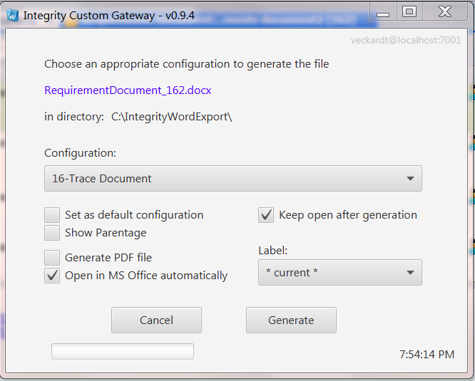

# IntegrityCustomGateway
An alternative starting form for Gateway export client processes, supporting Labels to pick, direct PDF export, pre-defined file name


## Purpose
The CustomGateway is a custom form to execute the Integrity gateway. It offers some very helpful features that were frequently requested by our PTC user community.



## Use Cases
- Replaces the Local Gateway form
- Direct PDF export
- Easier to handle exports
- Pre-defined File names
- Can run on items also (not only documents)

## Install
Option 1: In IntegrityClient folder
- Put the "dist/IntegrityCustomGateway.jar" directly into your IntegrityClient folder
- Copy also the files "dist/lib/IntegrityAPI.jar" and "dist/lib/jfxmessagebox-1.1.0.jar" into your IntegrityClient/lib folder
- Add a custom menu entry with:
```
name: Custom Gateway
program:  ../jre/bin/javaw.exe
parameter: -jar ../IntegrityCustomGateway.jar
```

Option 2: In a shared folder
- Take all files from "dist" folder and place them somewhere centrally
- Register a custom menu as described before, but with the following change
```
parameter: -jar <your shared folder>/IntegrityCustomGateway.jar
```

## Configuration
I have implemented two different options to limit the list of possible export configurations

- with a property on type level

Define a custom property on type level. Set the Export Configurations to the once you usually select in the Gateway. 
```
Name:  Gateway.Configurations
Value: <Export Configuration1>,<Export Configuration2>,<Export Configuration3>  (Hint: you need to have at least 2 configs listed here)
Description: (Custom) List of Standard Gateway Export Configurations to display for this type in the Pick List
```

- with an additional XML file on server

Alternatively, you can also put the to-be-displayed Export Configurations by type into a custom XML file on server

File location:   public_html/Custom-Gateway-Configurations.xml
```
<?xml version="1.0" encoding="UTF-8"?>
<configurations version="1.3">
   <!-- configs are used for the Custom Gateway Export process -->
   <!-- see IntegrityCustomGateway -->
      <typedef type="Requirement Document">
         <configs>
            <config>Sample MS Word Exporter -- with TOC page</config>
            <config>Dynamic-Document-Landscape</config>
            <config>Trace Document</config>
         </configs>
      </typedef>
</configurations>
```


## How to test
- open any document or just stay on one in the query result
- click Custom > Custom Gateway
- The custom form should open
- Start the Gateway with a click at the [Generate] button
- Then review the outcome

## Hints
- the target directory can be changed just by clicking at the folder name in the user form
- the form can be left open by activating [x] keep open after generation. This is also very helpful for developers of the layout where the generation process must be started multiple times 
- the PDF generation uses an included VBA script, called directly form Java. This VBA script opens an MS Word connection, opens the file and saves it as PDF.

## How to debug
- check the log file in your %temp% folder: IntegrityCustomGateway_2017-09-27.log
- check the standard log file in your Integrity client "bin" directory: Gateway.log 
- check the standard log file in your Integrity client "bin" directory: GatewayApp.log 

##  Development environment
- PTC Integrity LM 10.9 (also 11.0 should be fine)
- Netbeans 7.4 (or 8)
- Java 1.7 (or 1.8)

## Known Limitations
- the PDF export will only work for MS Word
- the PDF export requires a local MS Word 2010 installed
